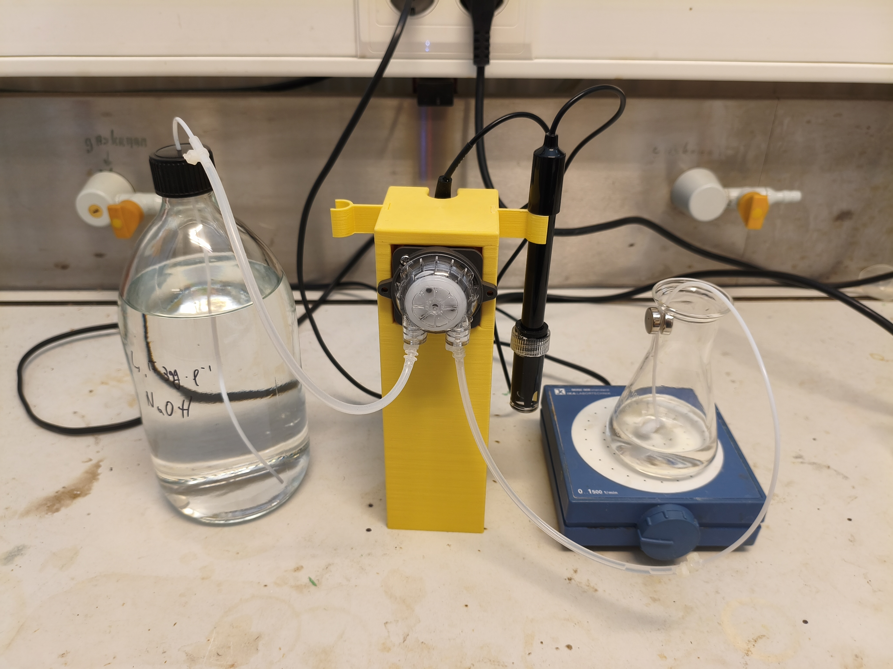
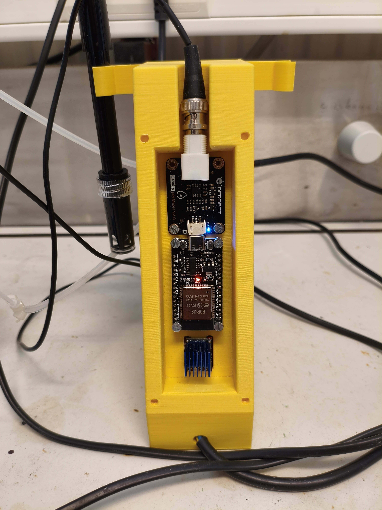

# Titrinator

An open-source automated titration system built around an ESP32, a peristaltic pump, and a pH probe.

Titrinator combines a motorized burette, wireless control, and real-time data acquisition into a low-cost platform suitable for chemistry education, hobby laboratories, and experimental automation projects.

Unlike traditional manual burettes, Titrinator dispenses titrant using a calibrated peristaltic pump driven by a NEMA17 stepper motor and a TMC2209 driver. The system continuously measures pH, records titration curves, and automatically detects equivalence points while being controlled entirely from a web browser over Bluetooth Low Energy (BLE).



---

## Features

* Automated titrant dispensing
* Real-time pH monitoring
* Live titration curve plotting
* Automatic equivalence point detection
* Wireless browser-based control
* No dedicated application required
* Local data storage on the ESP32
* Export of recorded titrations
* Pump and pH probe calibration routines
* Open-source hardware and software

---

## Hardware Overview

The current implementation uses:

| Component                  | Description                             |
| -------------------------- | ----------------------------------------|
| ESP32                      | Main controller and BLE interface       |
| TMC2209                    | Stepper motor driver                    |
| NEMA17 Stepper Motor       | Drives the pump                         |
| Peristaltic Pump           | Delivers titrant                        |
| pH Probe + Interface Board | Measures solution pH                    |
| 24 V Power Supply          | Powers the motor and electronics        |
| Step down converter        | Steps down to 5v for use by electronics |


### Peristaltic Pump

The system uses a laboratory-style peristaltic pump driven by a NEMA17 stepper motor.

Advantages of a peristaltic pump:

* The reagent only contacts the tubing
* Suitable for corrosive solutions
* No valves required
* Easy tubing replacement
* Simple maintenance
* Accurate volumetric control after calibration

### Architecture

```text
┌─────────────────────────────┐      BLE     ┌──────────────────────────┐
│ Browser Interface           │ ◄──────────► │ ESP32 Firmware           │
│ Vite + JavaScript           │              │ Pump Control             │
│ uPlot                       │              │ pH Measurement           │
│ JSZip                       │              │ Data Logging             │
└─────────────────────────────┘              └──────────────────────────┘
```

The browser acts as the complete user interface. No cloud services, server software, or USB connection are required during operation.

---

## Repository Structure

```text
firmware/        ESP32 firmware
src/             Web application source
public/          Static assets
index.html       Application entry point
vite.config.js   Vite configuration
package.json     Front-end dependencies
```

---

## Browser Compatibility

The user interface relies on the Web Bluetooth API.

Supported:

* Chrome (Windows, Linux, macOS)
* Chrome (Android)
* Chromium-based browsers

iOS:

* Bluefy browser

Not supported:

* Firefox
* Safari

---

## Installation

### Firmware

Install PlatformIO and open the `firmware/` directory.

Upload the firmware:

```bash
pio run --target upload
```

Adjust pin assignments if your hardware differs from the reference design.

### Web Interface

Install dependencies:

```bash
npm install
```

Run the development server:

```bash
npm run dev
```

Build a production version:

```bash
npm run build
```

---

## Calibration

### Pump Calibration

1. Prime the tubing.
2. Run the calibration routine.
3. Collect and weigh the dispensed water.
4. Enter the measured mass.
5. The firmware calculates and stores the conversion factor.

Calibration should be repeated whenever tubing is replaced.

### pH Calibration

The firmware supports both two-point and three-point calibration.

1. Select the calibration mode.
2. Place the probe in each buffer solution.
3. Wait for the reading to stabilise.
4. Confirm the calibration point.

A linearity indicator highlights probe behaviour that deviates from the expected response.

---

## Running a Titration

1. Connect to the ESP32.
2. Verify pump and pH calibrations.
3. Select the titration type.
4. Enter the target volume.
5. Place the probe and dosing tube into the analyte.
6. Start the titration.

During operation the system displays:

* Current pH
* Dispensed volume
* Live titration curve
* Detected equivalence points

Results are stored locally and can later be reviewed or exported.

---

## Data Storage

Titration records are stored in the ESP32 flash memory.

Stored data includes:

* pH measurements
* Dispensed volume
* Titration curves
* Equivalence point calculations

Records can be exported as ZIP archives for further analysis.

---

## Current Limitations

* Temperature compensation is not yet implemented.
* Web Bluetooth support is browser dependent.
* New titration modes currently require firmware modification.
* BLE communication is not authenticated.

---

## Future Development

Planned features include:

* Temperature compensation
* Additional titration methods
* Improved export formats

---

## License

Copyright © 2026 SheepSayMeh
